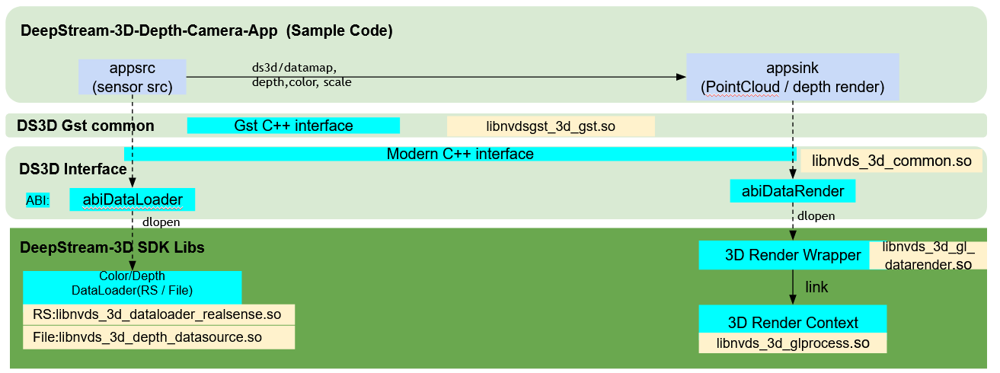
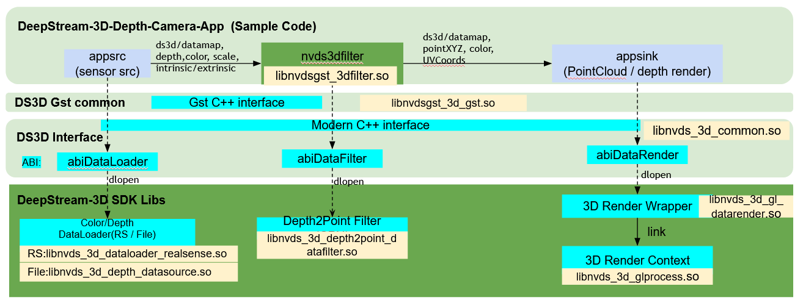

# deepstream-3d-depth-camera

---

deepstream-3d-depth-camera is an example to demonstrate depth and color images captured from realsense camera(DS435), then deepstream pipeline taken over the data for further processing.


# Table of contents

1. [Generate Docs](#Generate-Docs)
2. [Overview](#Overview)
3. [Run](#Run)
4. [Reference](#Reference)


<a name="Generate Docs"></a>
## Generate Docs 


---

- install and setup on local machine

```bash
# install apt library
sudo apt-get install -y doxygen

# create directory for docs t live in (update `Doxyfile`)
mkdir docs

# generate docs
doxygen
```

- view in your browser

```bash
# view in your browser by copy/pasting this filepath
echo `pwd`/docs/html/index.html
```


<a name="Overview"></a>
## Overview

---

__1. Application Config files__

There are 2 pipeline for tests.

a)  [ds_3d_realsense_depth_capture_render.yaml](./src/configs/ds_3d_realsense_depth_capture_render.yaml)
  
-   From depth and color images capture to 2D rendering pipeline


 

b) [ds_3d_realsense_depth_to_point_cloud.yaml](./src/configs/ds_3d_realsense_depth_to_point_cloud.yaml)

- From depth and color images capture, 3D points/color conversions, to 3D point-cloud rendering pipeline




__2. Config Files Explained__

A single configuration file is deployed for the whole pipelines. All components are updated in same config file. These components are set up by different `type`

  - `type: ds3d::dataloader`: load data source component (load from camera and ingest into pipeline).

  - `type: ds3d::datafilter`: load data filter component (process data).

  - `type: ds3d::datarender`: load data sink/render component (display to screen).

  - `type: ds3d::userapp`: application user-defined components (used for debugging and dumping data).

Each component is loaded through `custom_lib_path`, created through `custom_create_function`. The deepstream pipeline manages the life cycle of each component.

The processing pipeline could be ...

```bash

dataloader -> datafilter -> datarender
```

All of them are custom libs and connected by Deepstream Gstreamer pipelines.


__ds3d::dataloader__

- is created by explicit call of `NvDs3D_CreateDataLoaderSrc`.
- During this API call, the `custom_lib_path` is loaded and a specific data loader is created by `custom_create_function`. 
- Meanwhile, GstAppsrc is created and starts managing `ds3d::dataloader` dataflows. 
- Component `ds3d::dataloader` could be started by gst-pipeline automatically or by application call dataloader->start() manually.
- It is configured by YAML format with datatype: ds3d::dataloader.


__ds3d::datafilter__

-  is loaded through DeepStream Gst-plugin `nvds3dfilter`. 
- It is started by gst_element_set_state(GST_STATE_READY). 
- During this API call, the `custom_lib_path` is loaded and a specific data render is created by `custom_create_function`. 
- It is configured by YAML format with `datatype: ds3d::datafilter`. 
- Gst-plugin `nvds3dfilter` have properties `config-content` and `config-file`.
- One of them must be set to create a datafilter object.

__ds3d::datarender__

- is created by explicit call of `NvDs3D_CreateDataRenderSink`.
- During this API call, the `custom_lib_path` is loaded and a specific data render is created by `custom_create_function`. 
- Meanwhile, GstAppsink is created and starts managing `ds3d::datarender` dataflows. 
- Component `ds3d::datarender` could be started by gst-pipeline automatically or by application call datarender->start() function manually. 
- It is configured by YAML format with datatype: ds3d::datarender.


Inside the configuration files, `in_caps` and `out_caps` correspond to Gstreamer's sink_caps and src_caps.


---


<a name="Run"></a>
## Run


To run depth tests there are two options:
- 2D tests
- 3D tests

__2D tests__

- Run 2D depth capture and render pipeline:
- update .env with `CONFIG_FILE="example_point_cloud.yaml"`

```bash
$ make run
```

- below we explain the configurations for `src/configs/example_render.yaml`

\include example_render.yaml

- This pipeline set up a realsense dataloader (`ds3d::dataloader`)
```yaml
type: 3d::dataloader
custom_lib_path: libnvds_3d_dataloader_realsense.so
custom_create_function: createRealsenseDataloader
```    

- Then streams `ds3d/datamap` to final rendering component (`ds3d::depth-render`)
```yaml
type: 3d::datarender
custom_lib_path: libnvds_3d_gl_datarender.so
custom_create_function: createDepthStreamDataRender
```

- The depth-render shall display the depth data and color data together in same window. 
- Update `min_depth/max_depth` to remove foreground and background objects in depth rendering. 
- Update `min_depth_color/min_depth_color` [R, G, B] values to visualize color map of depth.

__3D tests__

- Run 3D tests for depth capture, 3D points conversion, and 3D point-cloud rendering.
- update .env with `CONFIG_FILE="example_point_cloud.yaml"`


```bash
$ make run 
```

- below we explain the configurations from `src/configs/example_point_cloud.yaml`

\include example_point_cloud.yaml

- This pipeline set up a realsense dataloader(same as 2D depth). Then streams `ds3d/datamap` to downstream `ds3d::datafilter` component `point2cloud_datafilter`,
```yaml
type: 3d::datafilter
custom_lib_path: libnvds_3d_depth2point_datafilter.so
custom_create_function: createDepth2PointFilter
```

- The filter could align the color image with depth image, and converts depth&color into 3d pointXYZ and pointCoordUV frames.
- Depth & color camera intrinsic & extrinsinc parameters are set by `realsense_dataloader`. They are inside `ds3d/datamap`. User can also get these parameters from `GuardDataMap`.
- Finally, deliver `ds3d/datamap` to datarender component `point-render` for rendering.
```yaml
type: 3d::datarender
custom_lib_path: libnvds_3d_gl_datarender.so
custom_create_function: createPointCloudDataRender
```

- Fields of `view_*` is the eye of view positon. similarly as OpenGL gluLookAt().
- Fields of `near/far/fov` is the perspective range of the eye, similarly as OpenGL gluPerspective()

- To quit application: 'CTRL + C' or close the window to quit.

- To get frames and structure from datamap, please refer to `appsrcBufferProbe` and `appsinkBufferProbe`. Suppose user has already a datamap from GstBuffer.

```c++
GuardDataMap dataMap;
```

- To get depth frame, user could
```c++
Frame2DGuard depthFrame;
dataMap.getGuardData(kDepthFrame, depthFrame)
```


- To get depth scale units,
```c++
DepthScale scale;
dataMap.getData(kDepthScaleUnit, scale);
```

- To get color frame, user could

```c++
Frame2DGuard colorFrame;
dataMap.getGuardData(kColorFrame, colorFrame);
```


- To get 3D points(XYZ based)
```c++
FrameGuard pointFrame;
dataMap.getGuardData(kPointXYZ, pointFrame);
```


- To get 3D points UV coordinates in color image
```c++
FrameGuard colorCoord;
dataMap.getGuardData(kPointCoordUV, colorCoord);
```

- To get depth and color intrinsic and depth2color extrinsic parameters.

```c++
IntrinsicsParam depthIntrinsics;
IntrinsicsParam colorIntrinsics;
ExtrinsicsParam d2cExtrinsics;
datamap.getData(kDepthIntrinsics, depthIntrinsics);
datamap.getData(kColorIntrinsics, colorIntrinsics);
datamap.getData(kDepth2ColorExtrinsics, d2cExtrinsics);
```

---


<a name="Reference"></a>
## Reference

- Read the [Deepstream sdk DS_3D_Depth_Camera](https://docs.nvidia.com/metropolis/deepstream/6.2/dev-guide/text/DS_3D_Depth_Camera.html) 
docs for information on how to configure and use the SDK 

- Read the [Deepstream api docs](https://docs.nvidia.com/metropolis/deepstream-nvaie30/sdk-api/namespaceds3d.html)
docs for more information about the ds3D namespace and how to use it

- read the [visual programming interface](https://docs.nvidia.com/vpi/algo_stereo_disparity.html) 
docs for how to app custom computer vision into the repo

- read the [DS_3D_Custom_Manual](https://docs.nvidia.com/metropolis/deepstream/dev-guide/text/DS_3D_Custom_Manual.html) docs
for how to implement an AI model using this set up

